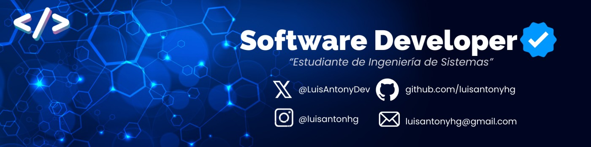

# 👋 ¡Hola! Soy Luis Antony 🚀

  

  

🚀 Sobre mí:

- 💼 Actualmente trabajo como desarrollador Sotfware en el Ministerio del Interior.
- 🌱 Apasionado por automatizar procesos con años de experiencia.
- 👯 Siempre aprendiendo sobre [tecno colaborar en proyectos innovadores y desafiantes
- 💡 Busco colaborar en proyectos innovadores y desafiantes específicos en tecnología]

### 📊 Mis Estadísticas de GitHub

### 🌟 Proyectos Destacados

#### [Nombre del Proyecto 1](link)
Breve descripción del proyecto, tecnologías utilizadas y tu rol.

#### [Nombre del Proyecto 2](link)
Breve descripción del proyecto, tecnologías utilizadas y tu rol.

### 📫 Conecta Conmigo

### 💼 Experiencia Profesional

- **[Empresa Actual]** - [Posición] _(Fecha - Presente)_
  - Logros y responsabilidades principales
- **[Empresa Anterior]** - [Posición] _(Fecha - Fecha)_
  - Logros y responsabilidades principales

---
⭐️ From [@luisantonyhg](https://github.com/luisantonyhg)
