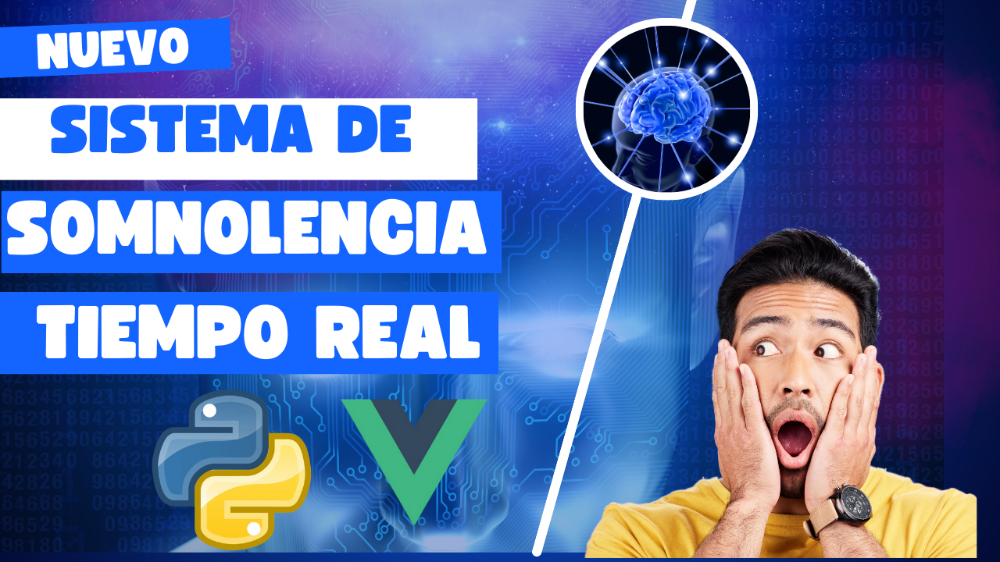
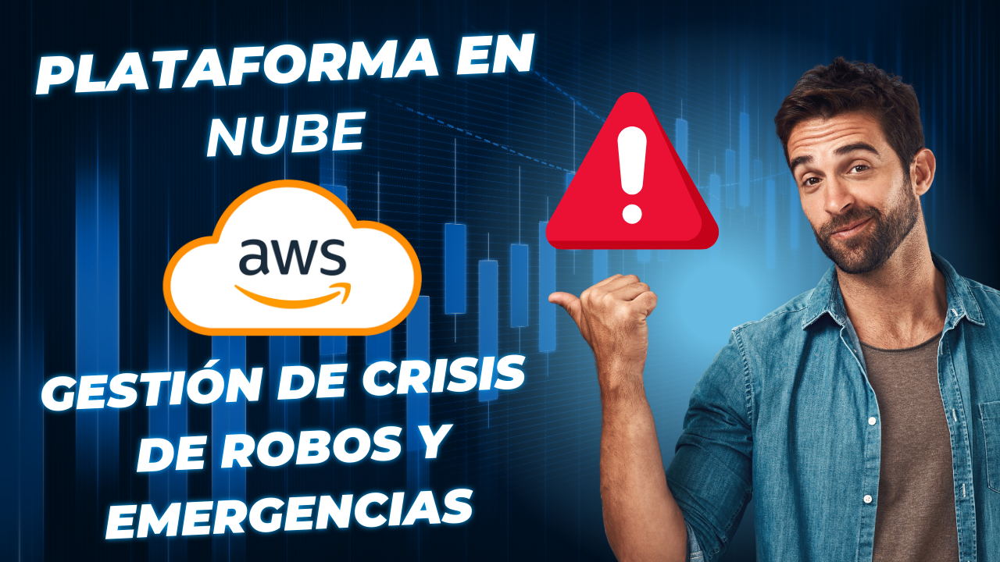
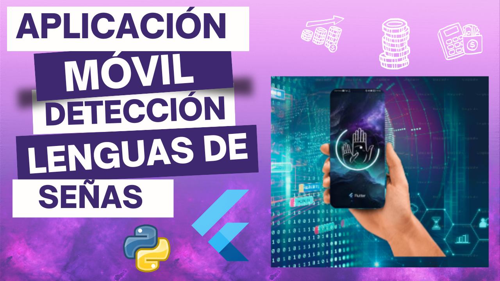

<h2 style="font-family: 'Georgia', serif; font-size:32px;">👋 Hola Soy Luis Antony Huamani Gonzales 🚀</h2>

  

 

  

<h2 style="font-family: 'Georgia', serif; font-size: 32px;">🚀 Sobre mí:</h2>

<ul style="font-family: 'Times New Roman', serif; font-size: 20px; list-style-type: circle;">
  <li>💼 Actualmente trabajo como desarrollador de software en el Ministerio del Interior.</li>
  <li>🌱 Apasionado por automatizar procesos con 7 años de experiencia.</li>
  <li>👯 Siempre aprendiendo nuevas tecnología.</li>
  <li>💡 Busco colaborar en proyectos innovadores y desafiantes en tecnología.</li>
</ul>
 
<h2 style="font-family: 'Georgia', serif; font-size:32px;">🚀 Mis Tecnologías y Herramientas </h2>
 

   
 
 
 
  
  
  
  
  
    
  
  
    
  
  
  
  
  
  
  

 
<h2 style="font-family: 'Georgia', serif; font-size:32px;">🚀 Mi Proyectos</h2>

Aquí muestro algunos proyectos de IA que he desarrollado, con enlaces al repositorio y videos en YouTube.
<table>
<tr>
    <td width="50%">
        <h3 align="center">DETECCIÓN ANTI-SOMNOLENCIA INTELIGENTE PARA CONDUCTORES EN TIEMPO REAL</h3>
        

            
            

                
                
            

            
Sistema de detección de visión por computador que detecta signos de somnolencia en conductores, algo crucial para prevenir accidentes por fatiga.

        

    </td>
    <td width="50%">
        <h3 align="center">PLATAFORMA EN LA NUBE DE AWS PARA LA GESTIÓN DE CRÍSIS DE ROBO Y EMERGENCIAS</h3>
        

            
            

                
                
            

            
Plataforma web en AWS, diseñada para generar alertas y gestionar emergencias en tiempo real, contribuyendo a la prevención de delitos.

        

    </td>
</tr>
<tr>
    <td width="50%">
        <h3 align="center">APLICACIÓN MÓVIL EN TIEMPO REAL PARA DETECCIÓN DE LENGUAS DE SEÑAS CON VISIÓN ARTIFICIAL</h3>
        

            
            

                
                
            

            
 Este es proyecto increíble que desarrollamos con mis compañeros como parte de nuestros estudios en Ingeniería de Sistemas en la Universidad Autónoma del Perú. Se trata de una aplicación móvil innovadora que utiliza visión por computadora para traducir en tiempo real la lengua de señas peruana (LSP)

        

    </td>

</tr>
</table>

<h4 align="center">Conteo de visitantes 👀</h4>

 

  <h2>¡Acompáñame en mi viaje de desarrollo! 🚀</h2>
  
¿Te gustan mis proyectos? Sígueme y construyamos algo increíble juntos 👋

  
💡 Si encuentras útiles mis repositorios, considera darme una estrella ⭐️

  
  
  
  
  

  

